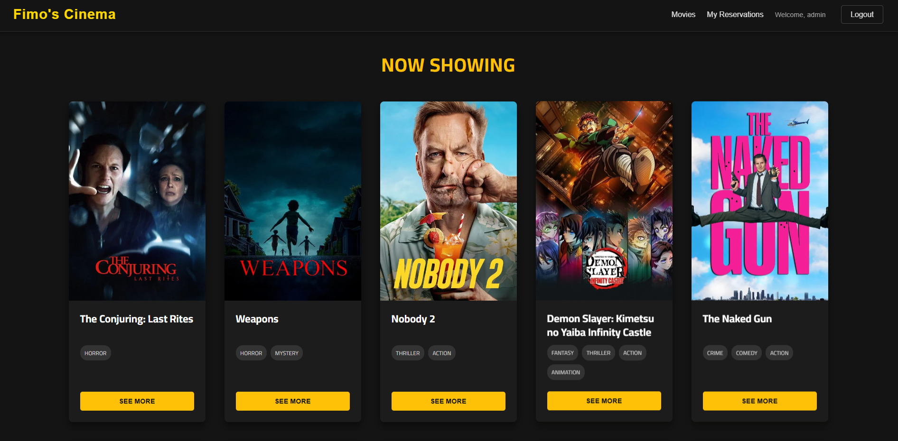
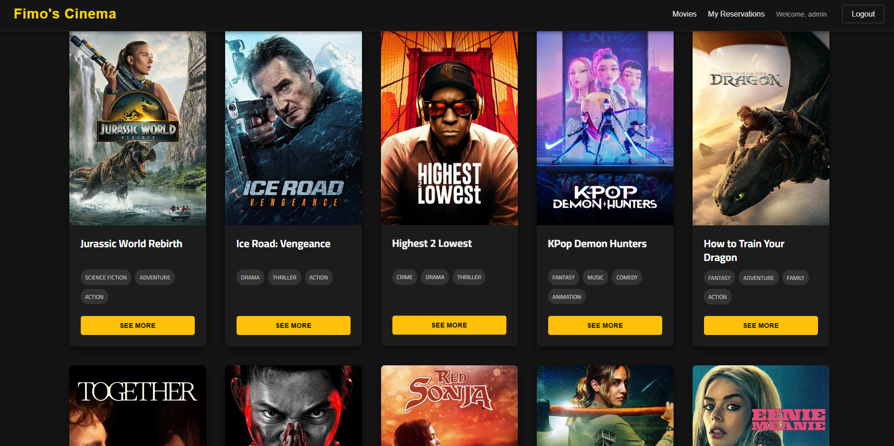
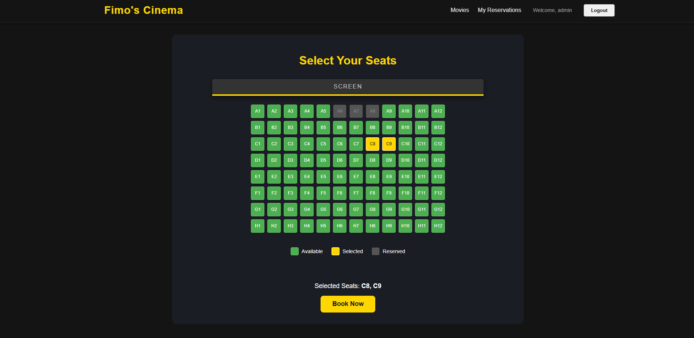

# Movie Reservation REST API 🍿

This is a complete backend service for a modern movie reservation platform, built with Java and the Spring Boot framework. It provides a full suite of RESTful API endpoints for user authentication, movie and showtime management, and a robust seat reservation system designed to prevent overbooking.

This backend is the engine for the **[Angular Frontend](https://github.com/M-Sayed939/Movie-Reservation-FrontEnd)**.

## Table of Contents

1.  [Preview](https://www.google.com/search?q=%23preview)
2.  [Features](https://www.google.com/search?q=%23features-)
3.  [Technology Stack](https://www.google.com/search?q=%23technology-stack-)
4.  [Getting Started](https://www.google.com/search?q=%23getting-started-)
5.  [API Endpoints](https://www.google.com/search?q=%23api-endpoints-)

## Preview

**Movie Browsing Page**


**Seat Reservation Page**


## Features ✨

- **Secure User Authentication:** Full sign-up and login functionality using **JWT (JSON Web Tokens)** for stateless, secure API access.
- **Role-Based Authorization:** Clear distinction between `ROLE_USER` and `ROLE_ADMIN` using Spring Security, protecting administrative endpoints.
- **TMDb API Integration:** Admins can import a list of popular, "now playing" movies directly from The Movie Database (TMDb).
- **Movie & Showtime Management:** Admin-only endpoints to manage the local movie catalog and schedule showtimes for different movies in specific cinema halls.
- **Complex Reservation Logic:** A transactional reservation system that allows users to book specific seats for a showtime, with database-level constraints to prevent overbooking.
- **Dynamic Seat Availability:** Endpoints to view available seats for any given showtime, enabling a frontend to render a visual seat map.

## Technology Stack 🛠️

- **Backend:** Java 17+, Spring Boot 3
- **Security:** Spring Security 6, JSON Web Tokens (JJWT)
- **Data Persistence:** Spring Data JPA (Hibernate)
- **Database:** PostgreSQL
- **External API Client:** `RestTemplate` for TMDb integration
- **Build Tool:** Apache Maven

## Getting Started 🚀

### Prerequisites

- Java Development Kit (JDK): Version 17 or higher
- Apache Maven
- PostgreSQL
- A TMDb API Key: Get one from [themoviedb.org](https://www.themoviedb.org/signup)

### 1\. Clone the Repository

```bash
git clone https://github.com/M-Sayed939/Movie-Reservation
cd Movie-Reservation
```

### 2\. Set Up the Database

1.  Connect to PostgreSQL as a superuser (`psql -U postgres`).
2.  Run the following SQL commands:
    ```sql
    CREATE DATABASE movie_db;
    CREATE USER movie_user WITH PASSWORD 'your_secure_password';
    GRANT ALL PRIVILEGES ON DATABASE movie_db TO movie_user;
    GRANT ALL ON SCHEMA public TO movie_user;
    ```

### 3\. Configure the Application

Open `src/main/resources/application.properties` and update it with your database credentials, TMDb key, and a secure JWT secret.

```properties
server.port=8081
spring.datasource.url=jdbc:postgresql://localhost:5432/movie_db
spring.datasource.username=movie_user
spring.datasource.password=your_secure_password
spring.jpa.hibernate.ddl-auto=update
app.jwt.secret=your-super-long-and-secure-jwt-secret-key
tmdb.api.key=your_tmdb_api_key_here
```

### 4\. Build and Run

The application includes a `CommandLineRunner` that will automatically create an initial admin user (`admin`/`adminpassword`) on the first startup.

```bash
mvn clean install
mvn spring-boot:run
```

The application will start on `http://localhost:8081`.

## API Endpoints 📖

Authenticated endpoints require an `Authorization: Bearer <token>` header.

| Method | Endpoint | Description | Access |
| :--- | :--- | :--- | :--- |
| **Auth** | | | |
| `POST` | `/api/auth/signup` | Register a new user. | Public |
| `POST` | `/api/auth/login` | Authenticate and get a JWT. | Public |
| **Admin** | | | |
| `POST`| `/api/admin/movies/import-popular`| Import popular movies from TMDb.| Admin |
| `POST`| `/api/admin/theaters` | Create a new cinema hall. | Admin |
| `POST`| `/api/admin/showtimes` | Schedule a new showtime. | Admin |
| **Public** | | | |
| `GET` | `/api/movies` | Get all available movies. | Public |
| `GET` | `/api/movies/{id}`| Get details of a single movie.| Public |
| `GET` | `/api/movies/{id}/showtimes?date=...` | Get showtimes for a movie. | Public |
| `GET` | `/api/showtimes/{id}/seats` | Get seat availability. | Public |
| **User** | | | |
| `POST`| `/api/reservations` | Create a new reservation. | User |
| `GET` | `/api/reservations/my-reservations` | Get the logged-in user's bookings.| User |

-----

-----
